# Vaiform Repo Architecture — Visual Diagram

This document is a **visual map** of how the repo is structured and what talks to what. It does not change any code; it reflects the current state of the repo for reasoning and scoping.

---

## 1. The Five Layers (Mental Model)

Think of Vaiform as **5 layers**. Keeping them separate makes the repo easier to reason about.

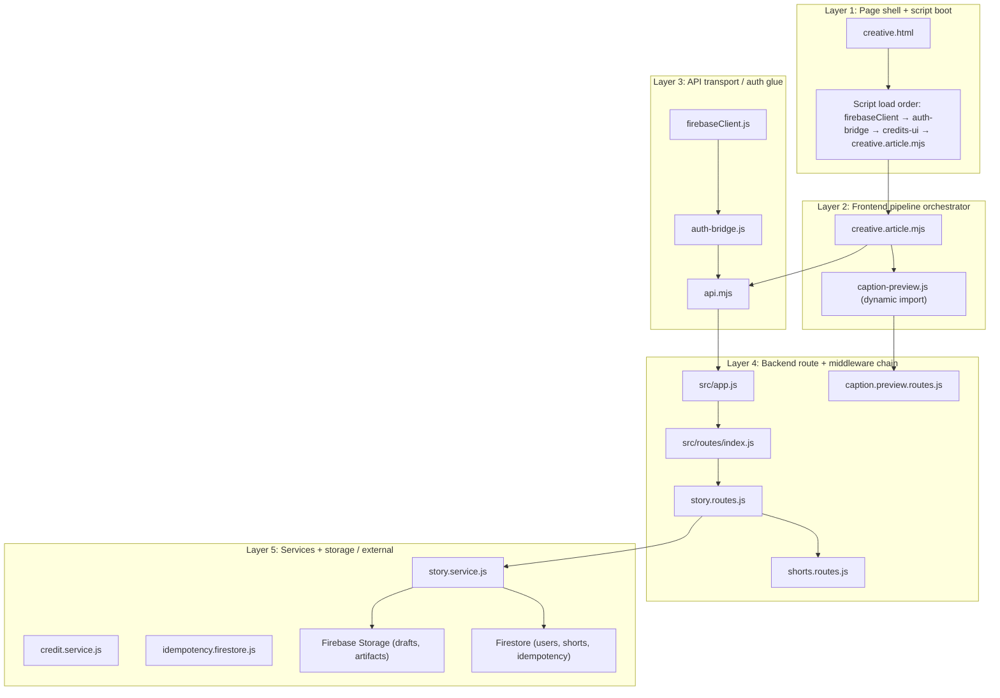

---

## 2. Page Shell Boot Order (Creative Page)

**Entry shell:** `web/public/creative.html`

Script load order matters. The following is the effective order (creative.html and how modules pull in dependencies):

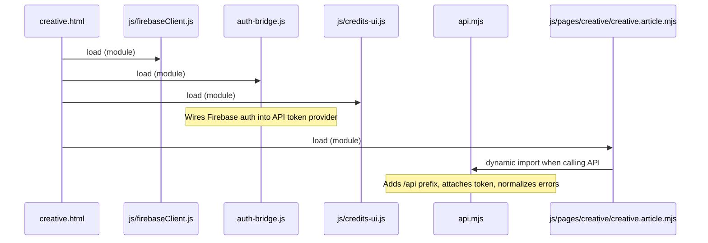

| Order | File                                                | Role                                                                         |
| ----- | --------------------------------------------------- | ---------------------------------------------------------------------------- |
| 1     | `web/public/js/firebaseClient.js`                   | Firebase app/auth/db; `ensureUserDoc()` → `/api/users/ensure`                |
| 2     | `web/public/auth-bridge.js`                         | Connects Firebase auth to api.mjs token provider; reacts to auth changes     |
| 3     | `web/public/js/credits-ui.js`                       | Credits display; `updateCreditsDisplay`, `fetchAndUpdateCredits`             |
| 4     | `web/public/js/pages/creative/creative.article.mjs` | Main UI pipeline (state, API calls, captions, storyboard, finalize, polling) |

**Important:** `api.mjs` is not a top-level script in creative.html; `creative.article.mjs` (and caption-preview) dynamically import it when making requests. If script order or globals change, routes can appear broken without any backend change.

---

## 3. Frontend API / Auth Glue (Hidden Support Beams)

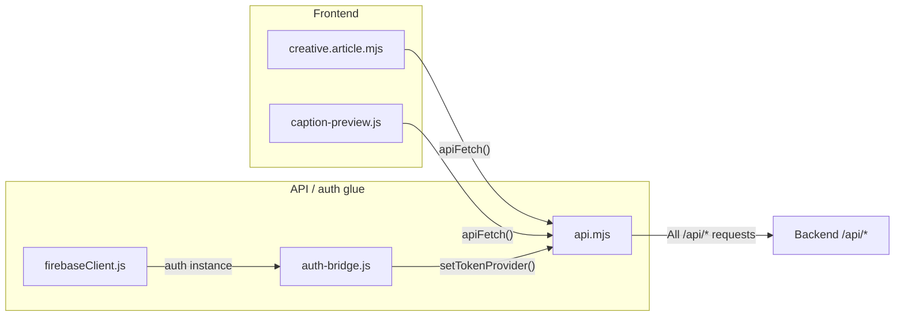

| File                  | Responsibility                                                                                                                                     |
| --------------------- | -------------------------------------------------------------------------------------------------------------------------------------------------- |
| **api.mjs**           | Transport: adds `/api` prefix, attaches auth token, normalizes errors; exposes `apiFetch()`. Most frontend code does not know backend URL details. |
| **auth-bridge.js**    | Auth bridge: connects Firebase auth to API token provider; ensures user record on first login.                                                     |
| **firebaseClient.js** | Firebase client: initializes app/auth/db; `ensureUserDoc()` calls `/api/users/ensure`.                                                             |

---

## 4. Backend Route + Middleware Chain

**App entry:** `server.js` → `src/app.js`

### 4.1 App mount order (src/app.js)

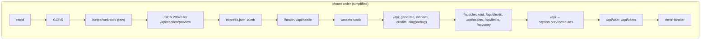

### 4.2 API route registry (src/routes/index.js)

This is the **backend route map** to read before touching any feature.

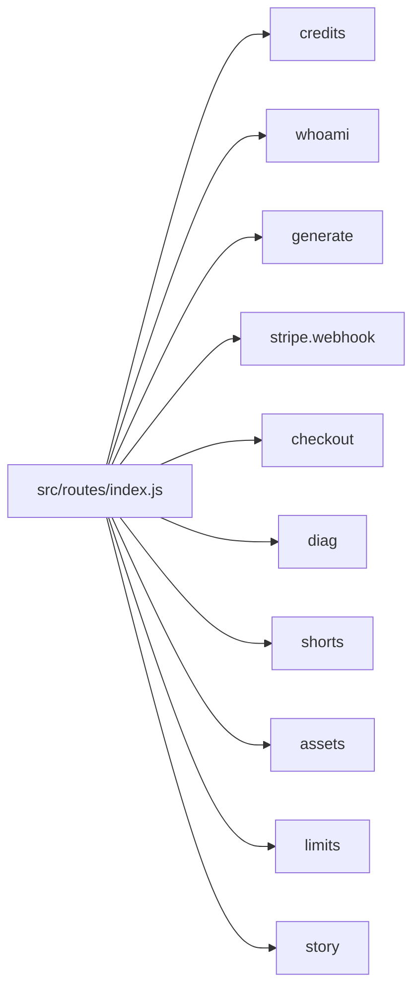

| Mount in app.js | Path            | Router source                                        |
| --------------- | --------------- | ---------------------------------------------------- |
| (direct)        | `/api`          | generate.routes.js → POST /generate, GET /job/:jobId |
| (direct)        | `/api/whoami`   | whoami.routes.js                                     |
| (direct)        | `/api/credits`  | credits.routes.js                                    |
| (direct)        | `/api/checkout` | checkout.routes.js                                   |
| (direct)        | `/api/shorts`   | shorts.routes.js                                     |
| (direct)        | `/api/assets`   | assets.routes.js                                     |
| (direct)        | `/api/limits`   | limits.routes.js                                     |
| (direct)        | `/api/story`    | story.routes.js                                      |
| (direct)        | `/api`          | caption.preview.routes.js → POST /caption/preview    |
| (direct)        | `/api/user`     | user.routes.js                                       |
| (direct)        | `/api/users`    | users.routes.js                                      |

**Note on drift:** If you ever see references to `./routes/index.routes.js`, `./middleware/requestLogger.js`, `./config/cors.js`, `./config/helmet.js`, `./middleware/session.middleware.js`, or `./middleware/limits.middleware.js` in app.js, that is the “old” mental model. The current repo uses `./routes/index.js`, inline CORS/helmet in app.js, `reqId.js`, `error.middleware.js`, etc. Keeping app.js and this diagram in sync avoids two mental models.

---

## 5. Story / Shorts Pipeline (Idea → Render → Status)

End-to-end chain from UI to storage and back.

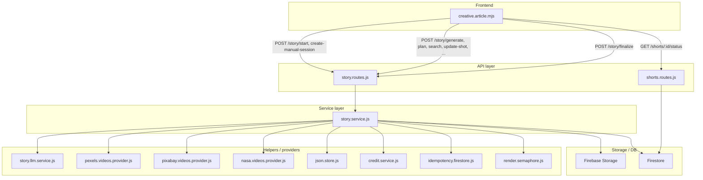

---

## 6. Pipeline Stages (A → F)

### A) Start / create session

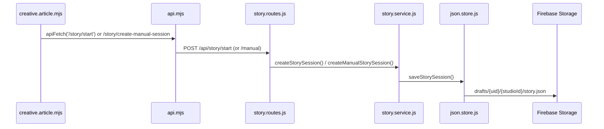

- **Backend:** `story.routes.js` → POST `/start`, POST `/manual` (create-manual-session flow).
- **Service:** `story.service.js` → `createStorySession()`, `saveStorySession()`.
- **Storage:** Session is JSON in **Firebase Storage** (not Firestore): `drafts/{uid}/story-<id>/story.json`. That JSON is the central object many story routes read/write.

### B) Generate script + plan beats

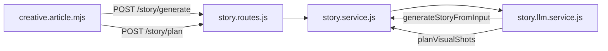

- **Routes:** POST `/story/generate`, POST `/story/plan`.
- **Service:** `generateStory()`, `planShotsForStory()`; LLM: `generateStoryFromInput()`, `planVisualShots()`.
- **Contract:** Any change to session shape (sentences, shots, caption style fields) affects generate, plan, update-shot, search-shot, timeline, captions, finalize.

### C) Storyboard asset search / shot editing

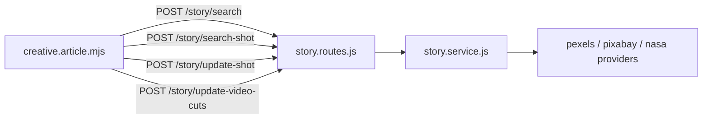

- **Routes:** POST `/story/search`, `/story/search-shot`, `/story/update-shot`, `/story/update-video-cuts`.
- **Service:** `searchShotsForSentence()`, etc.; providers: `pexels.videos.provider.js`, `pixabay.videos.provider.js`, `nasa.videos.provider.js`.
- **Separate surface:** `/api/assets` (assets.routes.js, assets.controller.js, assets.options.service.js) is for asset browsing/options; `/story/search*` is tied to story beats.

### D) Caption preview + caption metadata handshake

One of the most interconnected parts: **three places** must stay in sync.

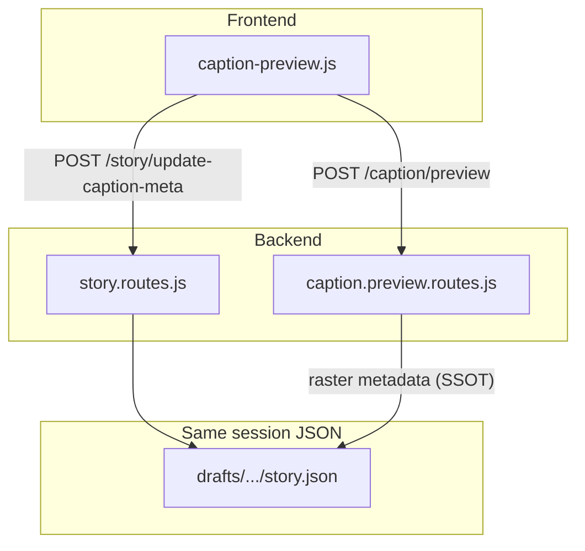

| Piece       | File(s)                                | Role                                                                                 |
| ----------- | -------------------------------------- | ------------------------------------------------------------------------------------ |
| Frontend    | `web/public/js/caption-preview.js`     | Uses `apiFetch('/caption/preview')`; batches writes to `/story/update-caption-meta`. |
| Preview API | `src/routes/caption.preview.routes.js` | POST `/caption/preview`; requireAuth + rate limit; SSOT raster metadata logic.       |
| Persistence | `src/routes/story.routes.js`           | POST `/story/update-caption-meta` writes into story session.                         |

Caption changes often touch all three; changing only one can cause drift.

### E) Finalize / render (main support beam)

**Frontend:** `creative.article.mjs` calls `POST /story/finalize`, then polls `GET /shorts/:id/status`.

**Backend finalize stack (story.routes.js):**

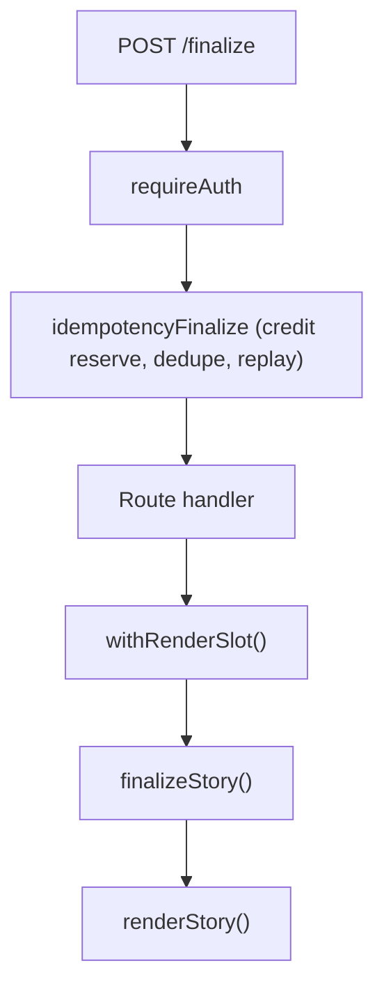

- **Middleware:** `requireAuth` (JWT → req.user); `idempotencyFinalize` (dedupe, stale/done replay, credit reserve).
- **Handler:** Calls `withRenderSlot(() => finalizeStory(...))` (render.semaphore.js for concurrency).
- **Service:** `story.service.js` → `finalizeStory()` → `renderStory()`.

**What renderStory() touches:**

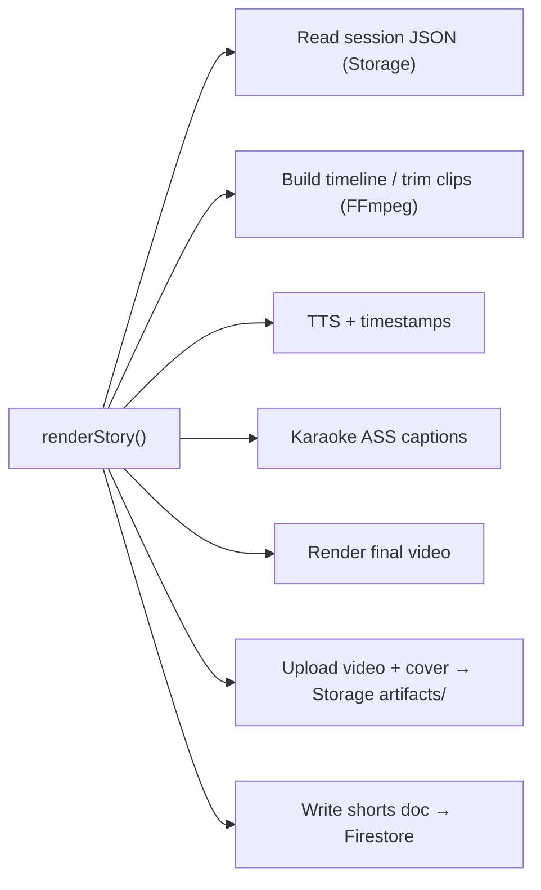

| Data store         | Use during finalize                            |
| ------------------ | ---------------------------------------------- |
| Draft session JSON | Firebase Storage `drafts/{uid}/.../story.json` |
| Credits            | Firestore `users/{uid}` (credit.service.js)    |
| Idempotency        | Firestore idempotency collection               |
| Final artifacts    | Firebase Storage `artifacts/{uid}/{jobId}/...` |
| Short job/status   | Firestore `shorts/{jobId}`                     |

Touching finalize can affect credits, idempotency, storage, and shorts status.

### F) Polling result / My Shorts

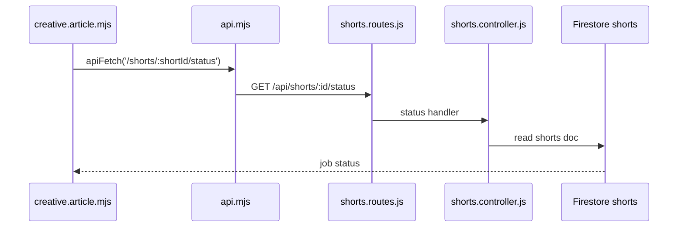

- **Backend:** `shorts.routes.js` → `shorts.controller.js` (reads Firestore shorts docs). This is the “tail” of the pipeline.

---

## 7. Repo-Wide Communication Map (Short)

**Main chain:**

```
Creative UI
  → api.mjs (auth/token/api envelope)
  → /api/story/* routes (route-level guards)
  → story.service.js (orchestration)
  → helpers/providers (story.llm.service, stock providers, TTS, FFmpeg, storage utils)
  → Storage / Firestore
  → /api/shorts/* status/read
  → UI polling / display
```

**Parallel caption branch:**

```
Caption editing
  → caption-preview.js
  → /api/caption/preview
  → /api/story/update-caption-meta
  → same story session JSON used by finalize
```

The caption branch is tightly tied to the main render branch via shared session shape and caption metadata.

---

## 8. Where to Scope Changes (By Surface)

Scope by **surface**, not by single file.

| Surface                      | If you touch…                                  | Always review                                                                                                                                                                                            |
| ---------------------------- | ---------------------------------------------- | -------------------------------------------------------------------------------------------------------------------------------------------------------------------------------------------------------- |
| **Story session contract**   | Session shape (beats, shots, captions, styles) | story.routes.js, story.service.js, creative.article.mjs, caption-preview.js (if captions)                                                                                                                |
| **Finalize / render safety** | Render, credits, retries                       | story.routes.js finalize stack, idempotency.firestore.js, planGuards.js, render.semaphore.js, credit.service.js, story.service.js (finalizeStory + renderStory), creative.article.mjs finalize + polling |
| **Auth / API plumbing**      | Auth, login, API errors                        | api.mjs, auth-bridge.js, firebaseClient.js, requireAuth.js, /users, /whoami, /credits routes                                                                                                             |

---

## 9. Quick Reference: Key Files

| Layer               | Key files                                                                                                                                   |
| ------------------- | ------------------------------------------------------------------------------------------------------------------------------------------- |
| Page shell          | `web/public/creative.html`                                                                                                                  |
| Orchestrator        | `web/public/js/pages/creative/creative.article.mjs`                                                                                         |
| API/auth glue       | `web/public/api.mjs`, `web/public/auth-bridge.js`, `web/public/js/firebaseClient.js`                                                        |
| Backend entry       | `server.js`, `src/app.js`                                                                                                                   |
| Route registry      | `src/routes/index.js`                                                                                                                       |
| Story API           | `src/routes/story.routes.js`                                                                                                                |
| Caption preview API | `src/routes/caption.preview.routes.js`                                                                                                      |
| Shorts read         | `src/routes/shorts.routes.js`, `src/controllers/shorts.controller.js`                                                                       |
| Story brain         | `src/services/story.service.js`                                                                                                             |
| Story LLM           | `src/services/story.llm.service.js`                                                                                                         |
| Session storage     | `src/utils/json.store.js` (Storage path: drafts/…)                                                                                          |
| Finalize guards     | `src/middleware/requireAuth.js`, `src/middleware/idempotency.firestore.js`, `src/middleware/planGuards.js`, `src/utils/render.semaphore.js` |
| Credits             | `src/services/credit.service.js`                                                                                                            |

---

_This diagram is documentation only; no application code or files were changed, added, or deleted._
