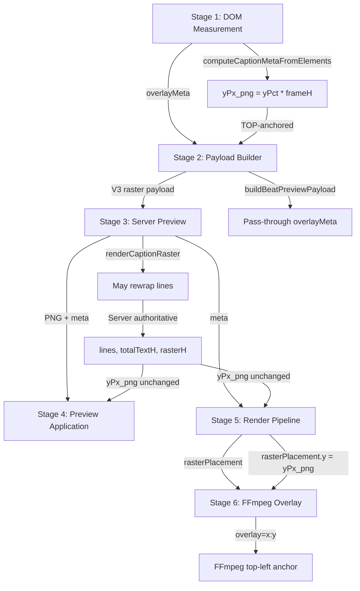

# Caption Pipeline Overview

**SSOT Documentation** - Maps the complete caption pipeline from client DOM measurement through preview generation to final render.

## Pipeline Map

The caption pipeline consists of 6 stages, each transforming or consuming caption metadata:

### Stage 1: Client DOM Measurement

**Purpose**: Extract caption geometry and styling from rendered DOM elements.

**Functions**:

- `computeCaptionMetaFromElements({ stageEl, boxEl, contentEl, frameW, frameH })`
  - **File**: `public/js/caption-overlay.js`
  - **Location**: Lines 1391-1558
  - **Exports**: `export function computeCaptionMetaFromElements`
- `measureBeatCaptionGeometry(text, style)`
  - **File**: `public/js/caption-overlay.js`
  - **Location**: Lines 1699-1811
  - **Exports**: `export function measureBeatCaptionGeometry`

**Inputs**:

- DOM elements: `#stage`, `.caption-box`, `.caption-box .content`
- Style object: `{ fontPx, fontFamily, weightCss, yPct, wPct, ... }`
- Frame dimensions: `frameW = 1080`, `frameH = 1920`

**Produces** (`overlayMeta` object):

- **Typography**: `fontPx`, `lineSpacingPx`, `letterSpacingPx`, `fontFamily`, `weightCss`, `fontStyle`, `textAlign`, `previewFontString`
- **Color & Effects**: `color`, `opacity`, `strokePx`, `strokeColor`, `shadowColor`, `shadowBlur`, `shadowOffsetX`, `shadowOffsetY`
- **Geometry**: `frameW`, `frameH`, `rasterW`, `rasterH`, `totalTextH`, `rasterPadding`, `xPct`, `yPct`, `wPct`, `yPx_png`, `xPx_png`, `xExpr_png`, `yPxFirstLine`
- **Line Data**: `lines[]` (browser-rendered line breaks)
- **Metadata**: `text`, `textRaw`, `ssotVersion: 3`

**Key Computation**:

```javascript
// caption-overlay.js:1493-1502
const yPct = (boxRect.top - stageRect.top) / stageHeight; // TOP-anchored
const yPx_png = Math.round(yPct * frameH); // TOP-left of raster PNG
const yPxFirstLine = yPx_png + rasterPadding; // First line baseline
```

---

### Stage 2: Client Payload Building

**Purpose**: Build V3 raster preview request payload from overlayMeta.

**Functions**:

- `buildBeatPreviewPayload(text, overlayMeta)`
  - **File**: `public/js/caption-preview.js`
  - **Location**: Lines 691-742
  - **Scope**: Module-level (not exported, used internally)
- `generateCaptionPreview(opts)`
  - **File**: `public/js/caption-preview.js`
  - **Location**: Lines 131-654
  - **Exports**: `export async function generateCaptionPreview`

**Inputs**:

- `overlayMeta` from Stage 1
- Optional `opts` object for live preview

**Produces** (V3 raster payload):

```javascript
{
  ssotVersion: 3,
  mode: 'raster',
  text, lines, fontPx, lineSpacingPx, fontFamily, weightCss, fontStyle,
  color, opacity, strokePx, strokeColor, shadowColor, shadowBlur,
  frameW, frameH, rasterW, rasterH, rasterPadding,
  xPx_png, yPx_png, xExpr_png, yPxFirstLine,
  totalTextH, previewFontString
}
```

**Key Behavior**:

- Passes through `overlayMeta` fields verbatim (no transformation)
- All required V3 raster fields must be present
- `yPx_png` uses TOP-left anchor (FFmpeg overlay semantics) - computed from box top position, not center

---

### Stage 3: Server Preview Endpoint

**Purpose**: Generate PNG raster overlay from client-provided geometry.

**Route**: `POST /api/caption/preview`  
**File**: `src/routes/caption.preview.routes.js`  
**Location**: Lines 65-1038

**Functions**:

- Route handler: `router.post("/caption/preview", express.json(), async (req, res) => { ... })`
  - **Location**: Lines 65-1038
- `renderCaptionRaster(meta)`
  - **File**: `src/routes/caption.preview.routes.js`
  - **Location**: Lines 1083-1546
  - **Scope**: Module-level (not exported, used internally)

**Schema Validation**:

- `RasterSchema` (Zod schema)
  - **Location**: Lines 11-61
  - **Required fields**: `ssotVersion: 3`, `mode: 'raster'`, `text`, `lines[]`, `rasterW`, `rasterH`, `yPx_png`, `totalTextH`, `yPxFirstLine`

**Inputs** (request body):

- Client-provided V3 raster payload from Stage 2

**Produces** (response `data.meta`):

```javascript
{
  ssotVersion: 3,
  mode: 'raster',
  rasterUrl: "data:image/png;base64,...",
  rasterW, rasterH, rasterPadding,
  xExpr_png, yPx_png,  // Echoed from client (or server-recomputed if rewrap)
  lines, totalTextH,  // Server-wrapped if rewrap occurred, else client lines
  rasterHash, previewFontString, previewFontHash,
  // ... all typography/color/effects fields echoed back
}
```

**Key Behavior**:

- **Server may rewrap lines** if overflow detected (lines 1182-1291)
- **Server recomputes** `rasterH` and `totalTextH` when rewrap occurs (lines 1251, 1260-1266)
- **Server keeps `yPx_png` unchanged** even after rewrap (line 242: `const finalYPx_png = yPx_png`)
- **Server is authoritative** for `lines`, `totalTextH`, `rasterH` when rewrap occurs (lines 238-240)

**Rewrap Behavior**:

- When server detects line overflow or mid-word splits, it rewraps lines using `wrapLinesWithFont()`
- Server recomputes: `serverTotalTextH` (formula-based), `serverRasterH` (includes padding + shadow)
- Server keeps unchanged: `yPx_png` (no positioning policy change, even if `rasterH` increases)
- Server is authoritative for: `lines`, `totalTextH`, `rasterH` when rewrap occurs
- Client must use server response `meta` as SSOT when rewrap occurred

---

### Stage 4: Client Preview Application

**Purpose**: Apply preview PNG to beat card DOM.

**Functions**:

- `applyPreviewResultToBeatCard(beatCardEl, result)`
  - **File**: `public/js/caption-preview.js`
  - **Location**: Lines 903-971
  - **Exports**: `export function applyPreviewResultToBeatCard`

**Inputs**:

- `beatCardEl`: DOM element (beat card container)
- `result`: `{ meta, rasterUrl }` from Stage 3 response

**Produces** (DOM changes):

- Creates/updates `.beat-caption-overlay` `` element
- Sets CSS variables: `--y-pct`, `--raster-w-ratio`, `--raster-h-ratio`
- Positions overlay using TOP-anchored `yPx_png` (no centering transform)

**Key Behavior**:

```javascript
// caption-preview.js:935-950
const yPct = Math.max(0, Math.min(1, meta.yPx_png / meta.frameH)); // Derive TOP yPct
overlayImg.style.setProperty('--y-pct', yPct);
// CSS: top: calc(var(--y-pct) * 100%);  // TOP-anchored, no translateY(-50%)
```

**CSS Positioning**:

- Uses TOP-left anchor (FFmpeg overlay semantics) - `yPct` derived from `meta.yPx_png / meta.frameH`
- CSS: `top: calc(var(--y-pct) * 100%)` (no `translateY(-50%)` centering transform)
- Matches FFmpeg overlay semantics (top-left anchor)

---

### Stage 5: Render Pipeline

**Purpose**: Build FFmpeg filter graph with caption PNG overlay.

**Functions**:

- `renderVideoQuoteOverlay({ overlayCaption, ... })`
  - **File**: `src/utils/ffmpeg.video.js`
  - **Location**: Lines 744-1781
  - **Exports**: `export async function renderVideoQuoteOverlay`
- `buildVideoChain({ rasterPlacement, overlayCaption, ... })`
  - **File**: `src/utils/ffmpeg.video.js`
  - **Location**: Lines 382-651
  - **Scope**: Module-level (not exported, used internally)

**Inputs**:

- `overlayCaption`: Caption meta object (from session storage or preview response)
- `rasterPlacement`: Optional pre-computed placement object

**Produces** (`rasterPlacement` object):

```javascript
{
  mode: 'raster',
  rasterW, rasterH,
  xExpr: '(W-overlay_w)/2' or absolute xPx_png,
  y: overlayCaption.yPx_png,  // TOP-left Y coordinate
  frameW, frameH, bgScaleExpr, bgCropExpr,
  rasterHash, previewFontString, rasterPadding
}
```

**Key Behavior**:

```javascript
// ffmpeg.video.js:1516-1523
const rasterPlacement = {
  y: overlayCaption.yPx_png ?? overlayCaption.yPx ?? 24, // Use PNG anchor
  xExpr: overlayCaption.xExpr_png || '(W-overlay_w)/2',
  // ...
};
```

---

### Stage 6: FFmpeg Overlay

**Purpose**: Composite caption PNG onto video using FFmpeg overlay filter.

**Function**: `buildVideoChain()` constructs filter graph  
**File**: `src/utils/ffmpeg.video.js`  
**Location**: Lines 382-651

**Inputs**:

- `rasterPlacement` from Stage 5
- `captionPngPath`: Temporary file path to PNG overlay

**Produces** (FFmpeg filter expression):

```
[0:v]scale=...crop=1080:1920[vmain]
[1:v]format=rgba[ovr]
[vmain][ovr]overlay=${xExpr}:${y}:format=auto[vout]
```

**Key Behavior**:

```javascript
// ffmpeg.video.js:515
const overlayExpr = `[vmain][ovr]overlay=${xExpr}:${y}:format=auto[vout]`;
// y is rasterPlacement.y which is overlayCaption.yPx_png (TOP-left anchor)
```

**FFmpeg Semantics**:

- `overlay=x:y` uses Y as **top-left** of overlay image
- No scaling applied to overlay (Design A: use preview dimensions verbatim)

---

## Data Flow Diagram



---

## Field Production/Consumption Table

| Field               | Stage 1 (DOM)                  | Stage 2 (Payload) | Stage 3 (Server)                            | Stage 4 (Preview)          | Stage 5 (Render)           | Stage 6 (FFmpeg)     |
| ------------------- | ------------------------------ | ----------------- | ------------------------------------------- | -------------------------- | -------------------------- | -------------------- |
| `yPx_png`           | ✅ Produces                    | ✅ Pass-through   | ✅ Echoes (or keeps unchanged after rewrap) | ✅ Consumes (derives yPct) | ✅ Consumes                | ✅ Uses as overlay Y |
| `yPct`              | ✅ Produces (TOP)              | ✅ Pass-through   | ⚠️ Optional (not used for positioning)      | ✅ Derives from yPx_png    | ❌ Not used                | ❌ Not used          |
| `rasterH`           | ✅ Produces                    | ✅ Pass-through   | ✅ Echoes (or recomputes if rewrap)         | ✅ Consumes                | ✅ Consumes                | ❌ Not used          |
| `totalTextH`        | ✅ Produces (DOM height)       | ✅ Pass-through   | ✅ Echoes (or recomputes if rewrap)         | ❌ Not used                | ❌ Not used                | ❌ Not used          |
| `lines`             | ✅ Produces (browser-rendered) | ✅ Pass-through   | ✅ Echoes (or rewraps if overflow)          | ❌ Not used                | ❌ Not used                | ❌ Not used          |
| `rasterW`           | ✅ Produces                    | ✅ Pass-through   | ✅ Echoes                                   | ✅ Consumes                | ✅ Consumes                | ❌ Not used          |
| `previewFontString` | ✅ Produces                    | ✅ Pass-through   | ✅ Echoes                                   | ❌ Not used                | ✅ Consumes (parity check) | ❌ Not used          |

**Legend**:

- ✅ Produces: Field is computed/created at this stage
- ✅ Pass-through: Field is forwarded unchanged
- ✅ Echoes: Server returns field (may recompute if rewrap)
- ✅ Consumes: Field is used for positioning/rendering
- ❌ Not used: Field is not consumed at this stage
- ⚠️ Optional: Field is present but not used for core logic

---

## Canonical Semantics & Ownership

### yPx_png (Locked Invariant)

**Canonical Meaning**: TOP-left Y coordinate of the raster PNG in frame-space pixels (0-1920).

**Ownership**: Client computes, server echoes (unchanged even after rewrap).

**Usage**:

- **Client**: `yPx_png = Math.round(yPct * frameH)` where `yPct` is TOP-anchored (box top position)
- **Server**: Echoes client value in response (line 242: `const finalYPx_png = yPx_png`)
- **FFmpeg**: Uses as overlay Y coordinate (top-left anchor)

**Code References**:

- Production: `public/js/caption-overlay.js:1502` (`computeCaptionMetaFromElements`)
- Consumption: `src/utils/ffmpeg.video.js:1523` (`rasterPlacement.y = overlayCaption.yPx_png`)
- FFmpeg: `src/utils/ffmpeg.video.js:515` (`overlay=${xExpr}:${y}`)

### yPct in V3 Raster Mode

**Status**: **Informational/debug-only** (not used for positioning in V3 raster mode).

**Semantics**: When present, represents TOP position percentage (0=top, 1=bottom).

**Behavior**:

- **Request**: Optional field (`yPct: z.coerce.number().optional()` at line 59)
- **Server**: Not used for positioning (comment at line 205: "Not used in raster, but pass for consistency")
- **Response**: Not included in `ssotMeta` (server only returns `yPx_png`)
- **Client derivation**: When needed, client derives TOP yPct from `yPx_png / frameH` (line 935)

**Decision**: yPct is **defined as TOP yPct only** (no center meaning anywhere in V3 raster mode). It is kept for backward compatibility and debugging but is not authoritative for positioning.

### Server Authority on Rewrap

**When rewrap occurs** (server detects line overflow or mid-word splits):

- **Server is authoritative** for: `lines`, `totalTextH`, `rasterH`
- **Server recomputes**: `serverTotalTextH`, `serverRasterH` from server-wrapped lines
- **Server keeps unchanged**: `yPx_png` (no positioning policy change)

**Response meta is SSOT**: Client must use server-provided `lines`, `totalTextH`, `rasterH` from response when rewrap occurred.

**Code References**:

- Rewrap detection: `src/routes/caption.preview.routes.js:1182-1291` (`renderCaptionRaster`)
- Server recomputation: `src/routes/caption.preview.routes.js:1251, 1260-1266`
- Response building: `src/routes/caption.preview.routes.js:238-240, 291, 323, 325`

---

## Future Placement Spec (top/center/bottom)

**Note**: This section defines future placement semantics. Current V3 raster mode uses TOP-anchored `yPx_png` only.

### Placement-Based yPx_png Calculation

When implementing placement presets (`'top'`, `'center'`, `'bottom'`), compute `yPx_png` as follows:

```javascript
// Future spec (not yet implemented)
function computeYPxFromPlacement(placement, rasterH, frameH = 1920) {
  const safeTopMargin = Math.max(50, frameH * 0.05); // 96px for 1920px
  const safeBottomMargin = frameH * 0.08; // 154px for 1920px

  let targetTop;
  switch (placement) {
    case 'top':
      // Place raster top at safe top margin
      targetTop = safeTopMargin;
      break;
    case 'center':
      // Center raster vertically
      targetTop = frameH / 2 - rasterH / 2;
      break;
    case 'bottom':
      // Place raster bottom at safe bottom margin
      targetTop = frameH - safeBottomMargin - rasterH;
      break;
    default:
      // Default to center
      targetTop = frameH / 2 - rasterH / 2;
  }

  // Clamp to safe margins
  const yPx_png = Math.max(safeTopMargin, Math.min(targetTop, frameH - safeBottomMargin - rasterH));

  return Math.round(yPx_png);
}
```

**Key Points**:

- `yPx_png` remains TOP-left of raster PNG (invariant)
- Placement affects the **target top position** calculation
- Safe margins prevent clipping (5% top, 8% bottom)
- Formula: `targetTop = f(placement, rasterH, frameH)` then clamp to safe margins

**Current State**: V3 raster mode does not use placement presets. Client computes `yPx_png` from DOM box position (TOP-anchored `yPct`).

---

## How to Verify

1. **Trace yPx_png flow**:
   - Client: Check `caption-overlay.js:1502` (production)
   - Server: Check `caption.preview.routes.js:242` (echo/unchanged)
   - Render: Check `ffmpeg.video.js:1523` (consumption)
   - FFmpeg: Check `ffmpeg.video.js:515` (overlay expression)

2. **Verify server authority on rewrap**:
   - Trigger rewrap (send lines that overflow `maxLineWidth`)
   - Check server logs: `[geom:server] Using server-recomputed values`
   - Verify response `meta.lines`, `meta.totalTextH`, `meta.rasterH` differ from request
   - Verify response `meta.yPx_png` matches request (unchanged)

3. **Verify TOP-anchored semantics**:
   - Check beat preview CSS: No `translateY(-50%)` transform
   - Check FFmpeg overlay: Y coordinate is top-left (not center)
   - Check client derivation: `yPct = yPx_png / frameH` (not `(yPx_png + rasterH/2) / frameH`)

---

## Cleanup Candidates

**Documentation only** - no code changes:

1. **Legacy contract doc**: `docs/caption-meta-contract.md`
   - **Status**: Outdated (does not cover V3 raster mode)
   - **Issue**: Defines `yPct` as anchor point with placement semantics, but V3 raster uses `yPx_png` (TOP-left) only
   - **Action**: Mark as legacy, reference new V3 contract docs

2. **Legacy preview path**: `src/routes/caption.preview.routes.js:417-1034`
   - **Status**: Gated by `ALLOW_LEGACY_PREVIEW` env var (disabled by default)
   - **Issue**: Unreachable code path (V3 path returns early at line 414)
   - **Action**: Consider removal if legacy support not needed

3. **yPxFirstLine field**: Present in payload but not used in render
   - **Status**: Debug-only field (computed as `yPx_png + rasterPadding`)
   - **Issue**: Adds complexity without functional benefit
   - **Action**: Consider deprecating if not needed for debugging

4. **Duplicate preview apply paths**: Confirmed duplicate
   - **SSOT**: `applyPreviewResultToBeatCard()` in `caption-preview.js` (lines 903-971) - **Canonical**
   - **Duplicate**: `BeatPreviewManager.applyPreview()` in `creative.html` (lines 6476-6518) - Inline implementation
   - **Issue**: `BeatPreviewManager.applyPreview()` duplicates logic from `applyPreviewResultToBeatCard()` (same DOM manipulation, same CSS variables)
   - **Action**: Refactor `BeatPreviewManager.applyPreview()` to call `applyPreviewResultToBeatCard()` instead of duplicating logic
